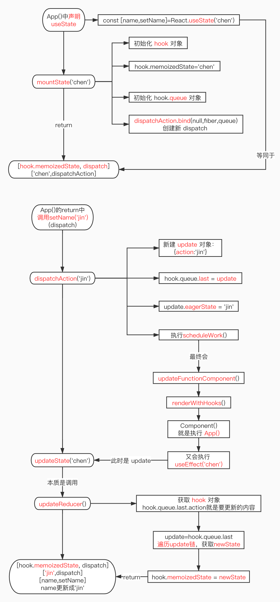
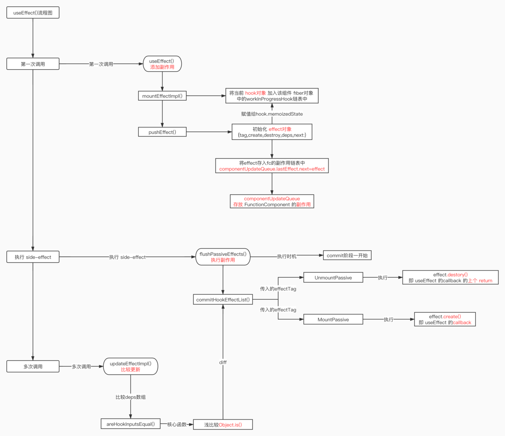

- React.useState('chen')，useState()的第一次调用，所以此时就会执行源码里的第一次会调用 mountState()：初始化 useState()，并返回一个数组；之后会调用 updateState()

- 调用 setName('jin')时，会执行 dispatchAction('jin')函数，
  (1) 新建 update 对象：{action:'jin'}
  (2) 将 update 加至 hook.queue 的末尾：hook.queue.last = update
  (3) 执行 scheduleWork()，走 updateFunctionComponent() 流程

- updateState()：多次更新 initialState 的值，其实是调用的 updateReducer，useState()的本质是 useReducer()

#### 为什么 useState 要按顺序执行？

- 当初始化三个 useState 时，Hooks 链是通过 next 来绑定三个 state 的顺序的，如果在多次调用 Hooks 时，将某一个 useState 有条件的省略掉，不执行，那么.next 的时候，获取的 state 就不是理想的 state，会造成 state 错位，所以 React 官方已经禁止这样做

#### useState 流程图



#### useEffect

```
mountEffect() >> mountEffectImpl(..., create, deps)
create:useEffect的第一个参数 callback，deps：useEffect 的第二个可选参数 []
```
- (1) 因为 ReactHooks 是给 FunctionComponent 提供副作用的函数，也就是说一定是有一个地方来存放 FunctionComponent 的副作用的，那么在源码里就是componentUpdateQueue链表来存放副作用的
  (2) 如果FunctionComponent的更新队列不存在，则调用createFunctionComponentUpdateQueue()来创建一个更新队列，并将该useEffect的effect对象放至更新队列队尾

- 综上，可以看到当第一次调用useEffect时，React 做了 3 件事：
  ① 将当前hook加入workInProgressHook链表中
  ② 初始化effect对象
  ③ 将effect对象加入componentUpdateQueue更新队列（FunctionComponent存放副作用的链表）队尾
  ④ 将effect对象赋值给hook.memoizedState

