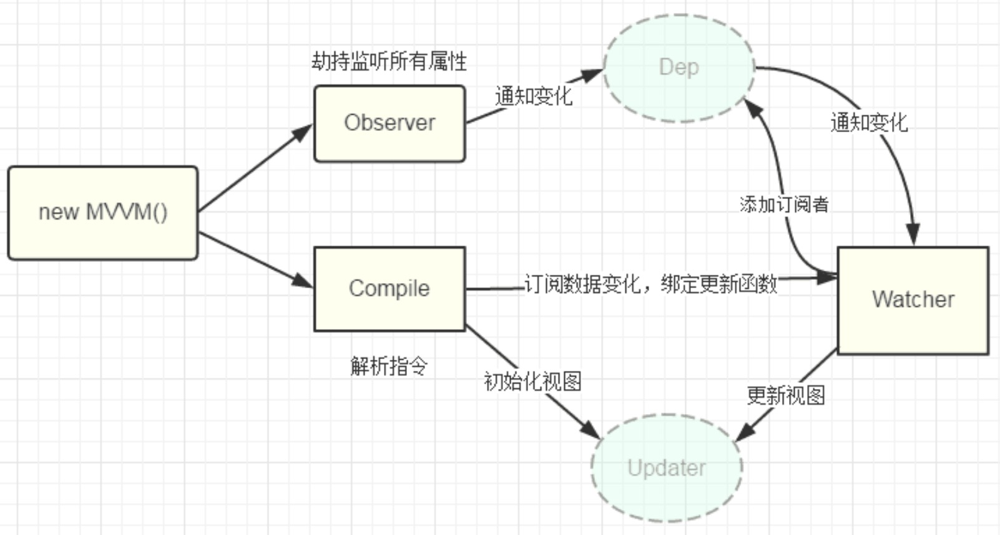

### 数据响应式
- Object.defineProperty()
- Proxy

### 模版引擎
- 插值：{{}}
- 指令：v-bind v-on v-model v-for v-if

### 渲染
- 模版=>vdom=>dom

### vue1.x原理分析


1. new Vue() 首先执行初始化，对data执行响应化处理，这个过程发生在Observer中
2. 同时对模板执行编译，找到其中动态绑定的数据，从data中获取并初始化视图，这个过程发生在Compile中
3. 同时定义一个更新函数和Watcher，将来对应数据变化时Watcher会调用更新函数
4. 由于data的某个key在一个视图中可能出现多次，所以每个key都需要一个管家Dep来管理多个Watcher，依赖收集watcher
5. 将来data中数据一旦发生变化，会首先找到对应的Dep，通知所有Watcher执行更新函数

```
// Dep.target静态属性上设置为当前watcher实例
Dep.target = this
this.vm[this.key] // 读取触发了getter
Dep.target = null // 收集完就置空

get() {
  console.log('get ' + key);
  // 依赖收集在这里
  Dep.target && dep.addDep(Dep.target)
  return val
},
```

### 1.x弊端，升级2.x

- watcher过多，不利于大项目
- VDOM出现
- ...